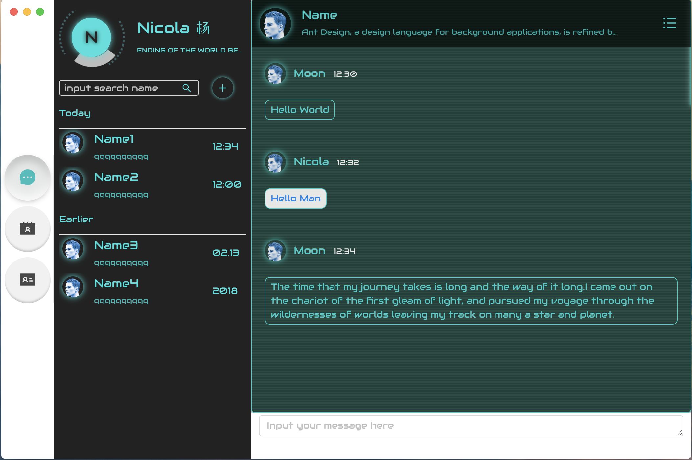

这个项目是我根据之前写的Boya聊天器项目改进过来的，不过虽然说是改进，确实从根本上就完全不同了。  

使用了electron来做了一个应用，目前是在mac上开发的，不知道其他系统上显示是否一致。  

使用的库是react，样式是根据antd和在codepen上看到的一些酷炫代码上修改过来的，做得比较偏于科技化的样式。  

大致上要实现的功能，目前的想法是：  

1.登陆，注册；  
2.聊天，包括群聊和私聊；  
3.目前是想要试下babylon.js，可能会填一些3D的东西，小游戏之类的吧。  
  
目前只完成了消息页面的制作，其他的正在进行中……

**消息页面图示**

## 第一步
git clone https://github.com/NicolaMoon/chat.git

## 第二步
cd app
npm install

## 第三步
npm start